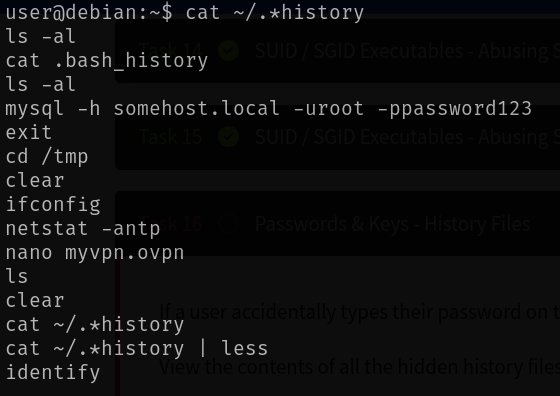

# Privileges Escalation - Linux
# Discovering passwords and keys

- [Local history inspection](#local-history-inspection)
- [Hidden files inspection](#hidden-files-inspection)

## Local history inspection
- `cat ~/.*history` to read the history of typed commands.

  

  If we find something like `mysql ... -u <user> -p <password>` we can exploit it. Even better if that user is **root**! (We could escalate privileges easily with `su root`)

## Hidden files inspection
- Inspecting hidden files or hidden directories is always important because something interesting could be found! 
- Just `ls -a` and look for useful stuffs.

